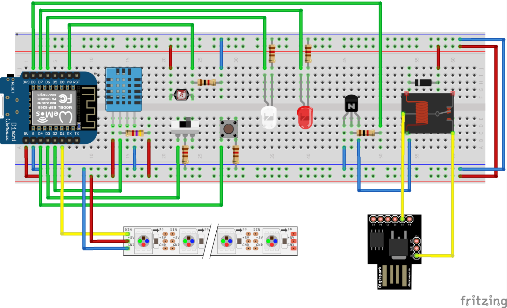

# Smart Workspace

 Welcome to our git repository! Here you will find everything related to the Smart Workspace project that was presented at ECESCON 10. The repository has been updated to include an up to date fritzing diagram of the project and all of its source code. Running the project is as simple as customizing the project files, flashing the boards with them, wiring everything up according to the fritzing diagram, downloading Blynk on your phone and configuring it according to the project files. You can click on the video link bellow for a demo of the project.
 

